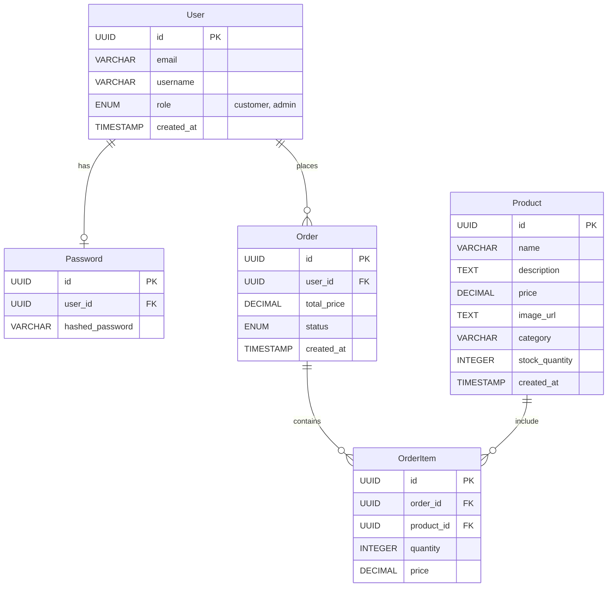

# Trisolaris Roastery API

## Overview



### API Endpoints

#### User

| Method | Endpoint             | Description                 |
| ------ | -------------------- | --------------------------- |
| POST   | /users               | Create a new user account   |
| GET    | /users/{id}          | Retrieve user details by ID |
| PATCH  | /users/{id}          | Update user details         |
| DELETE | /users/{id}          | Delete a user account       |
| PATCH  | /users/{id}/password | Update user password        |

#### Product

| Method | Endpoint       | Description                     |
| ------ | -------------- | ------------------------------- |
| POST   | /products      | Create a new product            |
| GET    | /products      | Retrieve a list of all products |
| GET    | /products/{id} | Retrieve product details by ID  |
| PATCH  | /products/{id} | Update product details          |
| DELETE | /products/{id} | Delete a product                |

#### Order

| Method | Endpoint                | Description                             |
| ------ | ----------------------- | --------------------------------------- |
| POST   | /orders                 | Create a new order for a user           |
| GET    | /orders/{id}            | Retrieve order details by ID            |
| GET    | /users/{user_id}/orders | Retrieve all orders for a specific user |
| PATCH  | /orders/{id}            | Update order details (e.g., status)     |
| DELETE | /orders/{id}            | Delete an order                         |

#### OrderItem

| Method | Endpoint                       | Description                                   |
| ------ | ------------------------------ | --------------------------------------------- |
| POST   | /order-items                   | Create a new order item                       |
| GET    | /order-items/{id}              | Retrieve order item details by ID             |
| GET    | /orders/{order_id}/order-items | Retrieve all order items for a specific order |
| PATCH  | /order-items/{id}              | Update order item details                     |
| DELETE | /order-items/{id}              | Delete an order item                          |

## Installation

To install dependencies:

```sh
bun install
```

To run:

```sh
bun run dev
```

open http://localhost:3000
