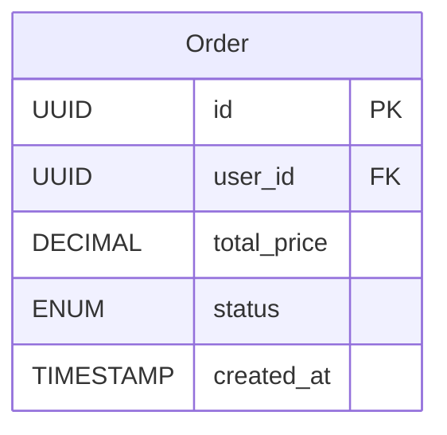

# Order API Contract

## Endpoints Overview

| Method | Endpoint                | Description                             |
| ------ | ----------------------- | --------------------------------------- |
| POST   | /orders                 | Create a new order for a user           |
| GET    | /orders/{id}            | Retrieve order details by ID            |
| GET    | /users/{user_id}/orders | Retrieve all orders for a specific user |
| PATCH  | /orders/{id}            | Update order details (e.g., status)     |
| DELETE | /orders/{id}            | Delete an order                         |

## Table



## API Specification

### 1. Create Order

**Method**: `POST`  
**Endpoint**: `/orders`

#### Request Body:

| Name        | Type   | Description                                               |
| ----------- | ------ | --------------------------------------------------------- |
| user_id     | UUID   | User ID (required)                                        |
| total_price | Float  | Total price of the order (required)                       |
| status      | string | Order status ("pending"/"shipped"/"delivered") (required) |

```json
{
  "user_id": "123e4567-e89b-12d3-a456-426655440000",
  "total_price": 150.0,
  "status": "pending"
}
```

#### Response (Success):

**201 Created**: The order has been successfully created.

```json
{
  "data": {
    "id": "987e6543-e89b-12d3-a456-426655440000",
    "user_id": "123e4567-e89b-12d3-a456-426655440000",
    "total_price": 150.0,
    "status": "pending"
  }
}
```

#### Response (Error):

**400 Bad Request**: Missing or invalid fields in the request body.

```json
{
  "error": {
    "message": "Invalid request data",
    "details": [
      "user_id is required",
      "total_price must be a positive numbers",
      "status is required",
      "status must be one of 'pending', 'shipped', 'delivered'"
    ]
  }
}
```

**404 Not Found**: User not found.

```json
{
  "error": {
    "message": "User not found"
  }
}
```

---

### 2. Get Order By Id

**Method**: `GET`  
**Endpoint**: `/orders/{id}`

#### Path Parameters:

| Name | Type | Description |
| ---- | ---- | ----------- |
| id   | UUID | Order ID    |

#### Response (Success):

**200 OK**: The order has been successfully retrieved.

```json
{
  "data": {
    "id": "987e6543-e89b-12d3-a456-426655440000",
    "user_id": "123e4567-e89b-12d3-a456-426655440000",
    "total_price": 150.0,
    "status": "pending",
    "created_at": "2024-11-12T08:00:00Z"
  }
}
```

#### Response (Error):

**404 Not Found**: The order with the provided ID does not exist.

```json
{
  "error": {
    "message": "Order not found"
  }
}
```

---

### 3. Get All Orders By User Id

**Method**: `GET`
**Endpoint**: `/users/{user_id}/orders`

#### Path Parameters:

| Name | Type | Description |
| ---- | ---- | ----------- |
| id   | UUID | User ID     |

#### Response (Success):

**200 OK**: The order has been successfully retrieved.

```json
{
  "data": [
    {
      "id": "987e6543-e89b-12d3-a456-426655440000",
      "user_id": "123e4567-e89b-12d3-a456-426655440000",
      "total_price": 150.0,
      "status": "pending",
      "created_at": "2024-11-12T08:00:00Z"
    },
    {
      "id": "987e6543-e89b-12d3-a456-426655440001",
      "user_id": "123e4567-e89b-12d3-a456-426655440000",
      "total_price": 200.0,
      "status": "delivered",
      "created_at": "2024-11-10T08:00:00Z"
    }
  ]
}
```

#### Response (Error):

**404 Not Found**: The order with the provided ID does not exist.

```json
{
  "error": {
    "message": "Order not found"
  }
}
```

---

### 4. Update Order By Id

**Method**: `PATCH`  
**Endpoint**: `/orders/{id}`

#### Path Parameters:

| Name | Type | Description |
| ---- | ---- | ----------- |
| id   | UUID | Order ID    |

#### Request Headers:

| Header | Type   | Description                 |
| ------ | ------ | --------------------------- |
| token  | string | JWT token for authorization |

#### Request Body:

| Name        | Type   | Description                                               |
| ----------- | ------ | --------------------------------------------------------- |
| total_price | Float  | Total price of the order                       |
| status      | string | Order status ("pending"/"shipped"/"delivered") |

```json
{
  "total_price": 200.0,
}

{
  "status": "delivered"
}
```

#### Response (Success):

**200 OK**: The user account has been successfully updated.

```json
{
  "data": {
    "id": "987e6543-e89b-12d3-a456-426655440000",
    "user_id": "123e4567-e89b-12d3-a456-426655440000",
    "total_price": 150.00,
    "status": "delivered",
    "created_at": "2024-11-12T08:00:00Z"
  }
}

```

#### Response (Error):

**400 Bad Request**: Missing or invalid fields in the request body.

```json
{
  "error": {
    "message": "Invalid request data",
    "details": ["Must include at least one field to update (total price or status)", "total_price must be a positive number", "status must be one of 'pending', 'shipped', or 'delivered'"]
  }
}
```

**404 Not Found**: The order with the provided ID does not exist.

```json
{
  "error": {
    "message": "Order not found"
  }
}
```

**401 Unauthorized**: User is not authorized to update this order.

```json
{
  "error": {
    "message": "Unauthorized"
  }
}
```

**403 Forbidden**: User is not authorized to update this order.

```json
{
  "error": {
    "message": "Forbidden"
  }
}
```

---

### 5. Delete Order By Id

**Method**: `DELETE`
**Endpoint**: `/orders/{id}`

#### Path Parameters:

| Name | Type | Description |
| ---- | ---- | ----------- |
| id   | UUID | Order ID     |

#### Request Headers:

| Header | Type   | Description                 |
| ------ | ------ | --------------------------- |
| token  | string | JWT token for authorization |

#### Response (Success):

**200 OK**: The order has been successfully deleted.

```json
{
  "data": {
    "id": "987e6543-e89b-12d3-a456-426655440000",
    "user_id": "123e4567-e89b-12d3-a456-426655440000",
    "total_price": 150.00,
    "status": "pending",
    "created_at": "2024-11-12T08:00:00Z"
  }
}

```

#### Response (Error):

**404 Not Found**: The order with the provided ID does not exist.

```json
{
  "error": {
    "message": "Order not found"
  }
}

```

**401 Unauthorized**: User is not authorized to delete this order.

```json
{
  "error": {
    "message": "Unauthorized"
  }
}
```

**403 Forbidden**: User is not authorized to delete this order.

```json
{
  "error": {
    "message": "Forbidden"
  }
}
```
