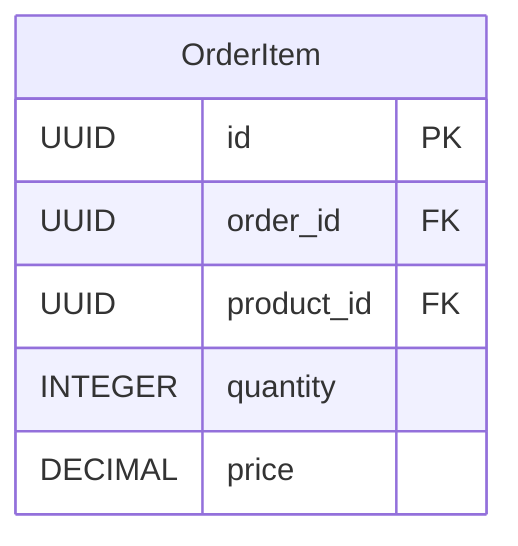

# OrderItem API Contract

## Endpoints Overview

| Method | Endpoint                       | Description                                   |
| ------ | ------------------------------ | --------------------------------------------- |
| POST   | /order-items                   | Create a new order item                       |
| GET    | /order-items/{id}              | Retrieve order item details by ID             |
| GET    | /orders/{order_id}/order-items | Retrieve all order items for a specific order |
| PATCH  | /order-items/{id}              | Update order item details                     |
| DELETE | /order-items/{id}              | Delete an order item                          |

## Table



## API Specification

### 1. Create OrderItem

**Method**: `POST`  
**Endpoint**: `/order-items`

#### Request Body:

| Name       | Type    | Description                |
| ---------- | ------- | -------------------------- |
| order_id   | UUID    | Order ID                   |
| product_id | UUID    | Product ID                 |
| quantity   | INTEGER | Quantity of the order item |
| price      | DECIMAL | Price of the order item    |

```json
{
  "order_id": "987e6543-e89b-12d3-a456-426655440000",
  "product_id": "123e4567-e89b-12d3-a456-426655440001",
  "quantity": 2,
  "price": 10.99
}
```

#### Response (Success):

**201 Created**: The order item has been successfully created.

```json
{
  "data": {
    "id": "987e6543-e89b-12d3-a456-426655440000",
    "order_id": "123e4567-e89b-12d3-a456-426655440000",
    "product_id": "987e6543-e89b-12d3-a456-426655440001",
    "quantity": 2,
    "price": 10.99
  }
}
```

#### Response (Error):

**400 Bad Request**: Missing or invalid fields in the request body.

```json
{
  "error": {
    "message": "Invalid request data",
    "details": [
      "order_id is required",
      "product_id is required",
      "quantity is required",
      "price is required",
      "order_id must be a UUID",
      "product_id must be a UUID",
      "quantity must be a number",
      "price must be a number"
    ]
  }
}
```

---

### 2. Get OrderItem by Id

**Method**: `GET`  
**Endpoint**: `/order-items/{id}`

#### Path Parameters:

| Name | Type | Description   |
| ---- | ---- | ------------- |
| id   | UUID | Order Item ID |

#### Response (Success):

**200 OK**: The order item has been successfully retrieved.

```json
{
  "data": {
    "id": "987e6543-e89b-12d3-a456-426655440000",
    "order_id": "123e4567-e89b-12d3-a456-426655440000",
    "product_id": "987e6543-e89b-12d3-a456-426655440001",
    "quantity": 2,
    "price": 10.99
  }
}
```

#### Response (Error):

**404 Not Found**: The order item with the provided ID does not exist.

```json
{
  "error": {
    "message": "Order item not found"
  }
}
```

---

### 3. Get OrderItem by Order Id

**Method**: `GET`
**Endpoint**: `/orders/{order_id}/order-items`

#### Path Parameters:

| Name     | Type | Description |
| -------- | ---- | ----------- |
| order_id | UUID | Order ID    |

#### Response (Success):

**200 OK**: The list of order items for the specified order has been successfully retrieved.

```json
{
  "data": [
    {
      "id": "987e6543-e89b-12d3-a456-426655440000",
      "order_id": "123e4567-e89b-12d3-a456-426655440000",
      "product_id": "987e6543-e89b-12d3-a456-426655440001",
      "quantity": 2,
      "price": 10.99
    },
    {
      "id": "123e4567-e89b-12d3-a456-426655440001",
      "order_id": "123e4567-e89b-12d3-a456-426655440000",
      "product_id": "123e4567-e89b-12d3-a456-426655440002",
      "quantity": 1,
      "price": 20.99
    }
  ]
}
```

#### Response (Error):

**404 Not Found**: No order items found for the provided order ID.

```json
{
  "error": {
    "message": "No order items found for this order"
  }
}
```

---

### 4. Update OrderItem By Id

**Method**: `PATCH`  
**Endpoint**: `/order-items/{id}`

#### Path Parameters:

| Name | Type | Description   |
| ---- | ---- | ------------- |
| id   | UUID | Order Item ID |

#### Request Headers:

| Header | Type   | Description                 |
| ------ | ------ | --------------------------- |
| token  | string | JWT token for authorization |

#### Request Body:

| Name     | Type   | Description |
| -------- | ------ | ----------- |
| quantity | number | Quantity    |
| price    | number | Price       |

```json
{
  "quantity": 3
}
```

#### Response (Success):

**200 OK**: The order item has been successfully updated.

```json
{
  "data": {
    "id": "987e6543-e89b-12d3-a456-426655440000",
    "order_id": "123e4567-e89b-12d3-a456-426655440000",
    "product_id": "987e6543-e89b-12d3-a456-426655440001",
    "quantity": 3,
    "price": 10.99
  }
}
```

#### Response (Error):

**400 Bad Request**: Missing or invalid fields in the request body.

```json
{
  "error": {
    "message": "Invalid request data",
    "details": [
      "Must include at least one field (quantity/price) to update",
      "quantity must be a number",
      "price must be a number"
    ]
  }
}
```

**404 Not Found**: The order item with the provided ID does not exist.

```json
{
  "error": {
    "message": "Order item not found"
  }
}
```

**401 Unauthorized**: User is not authorized to update this order item.

```json
{
  "error": {
    "message": "Unauthorized"
  }
}
```

**403 Forbidden**: User is not authorized to update this order item.

```json
{
  "error": {
    "message": "Forbidden"
  }
}
```

---

### 5. Delete OrderItem By Id

**Method**: `DELETE`
**Endpoint**: `/order-items/{id}`

#### Path Parameters:

| Name | Type | Description   |
| ---- | ---- | ------------- |
| id   | UUID | Order Item ID |

#### Request Headers:

| Header | Type   | Description                 |
| ------ | ------ | --------------------------- |
| token  | string | JWT token for authorization |

#### Response (Success):

**200 OK**: The order item has been successfully deleted.

```json
{
  "data": {
    "id": "987e6543-e89b-12d3-a456-426655440000",
    "order_id": "123e4567-e89b-12d3-a456-426655440000",
    "product_id": "987e6543-e89b-12d3-a456-426655440001",
    "quantity": 2,
    "price": 10.99
  }
}
```

#### Response (Error):

**404 Not Found**: The order item with the provided ID does not exist.

```json
{
  "error": {
    "message": "Order item not found"
  }
}
```

**401 Unauthorized**: User is not authorized to delete this order item.

```json
{
  "error": {
    "message": "Unauthorized"
  }
}
```

**403 Forbidden**: User is not authorized to delete this order item.

```json
{
  "error": {
    "message": "Forbidden"
  }
}
```
