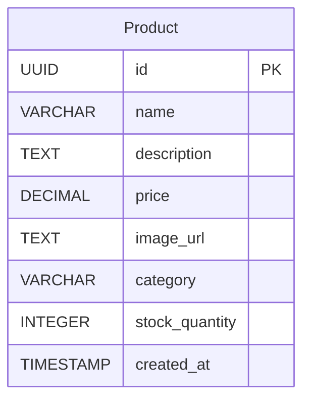

# Product API Contract

## Endpoints Overview

| Method | Endpoint       | Description                     |
| ------ | -------------- | ------------------------------- |
| POST   | /products      | Create a new product            |
| GET    | /products      | Retrieve a list of all products |
| GET    | /products/{id} | Retrieve product details by ID  |
| PATCH  | /products/{id} | Update product details          |
| DELETE | /products/{id} | Delete a product                |

## Table



## API Specification

### 1. Create Product

**Method**: `POST`  
**Endpoint**: `/products`

#### Request Body:

| Name           | Type   | Description                         |
| -------------- | ------ | ----------------------------------- |
| name           | string | Product name (required)             |
| description    | string | Product description (required)      |
| price          | number | Product price (required)            |
| image_url      | string | URL of the product image (required) |
| category       | string | Product category (required)         |
| stock_quantity | number | Product stock quantity (required)   |

```json
{
  "name": "Product A",
  "description": "Description of Product A",
  "price": 10.99,
  "image_url": "https://example.com/product-a.jpg",
  "category": "Category A",
  "stock_quantity": 50
}
```

#### Response (Success):

**201 Created**: The product has been successfully created.

```json
{
  "data": {
    "id": "987e6543-e89b-12d3-a456-426655440000",
    "name": "Product A",
    "description": "Description of Product A",
    "price": 10.99,
    "image_url": "https://example.com/product-a.jpg",
    "category": "Category A",
    "stock_quantity": 50
  }
}
```

#### Response (Error):

**400 Bad Request**: Missing or invalid fields in the request body.

```json
{
  "error": {
    "message": "Invalid request data",
    "details": [
      "name is required",
      "description is required",
      "price is required",
      "image_url is required",
      "category is required",
      "stock_quantity is required",
      "name must be a string",
      "description must be a string",
      "price must be a number",
      "image_url must be a string",
      "category must be a string",
      "stock_quantity must be a number"
    ]
  }
}
```

---

### 2. Get All Products

**Method**: `GET`  
**Endpoint**: `/products`

#### Response (Success):

**200 OK**: The list of products has been successfully retrieved.

```json
{
  "data": [
    {
      "id": "987e6543-e89b-12d3-a456-426655440000",
      "name": "Product A",
      "description": "Description of Product A",
      "price": 10.99,
      "image_url": "https://example.com/product-a.jpg",
      "category": "Category A",
      "stock_quantity": 50,
      "created_at": "2024-11-12T08:00:00Z"
    },
    {
      "id": "123e4567-e89b-12d3-a456-426655440001",
      "name": "Product B",
      "description": "Description of Product B",
      "price": 20.99,
      "image_url": "https://example.com/product-b.jpg",
      "category": "Category B",
      "stock_quantity": 30,
      "created_at": "2024-11-10T08:00:00Z"
    }
  ]
}
```

#### Response (Error):

**404 Not Found**: No products found.

```json
{
  "error": {
    "message": "Products not found"
  }
}
```

---

### 3. Get Product by Id

**Method**: `GET`
**Endpoint**: `/products/{id}`

#### Path Parameters:

| Name | Type | Description |
| ---- | ---- | ----------- |
| id   | UUID | Product ID  |

#### Response (Success):

**200 OK**: The product has been successfully retrieved.

```json
{
  "data": {
    "id": "987e6543-e89b-12d3-a456-426655440000",
    "name": "Product A",
    "description": "Description of Product A",
    "price": 10.99,
    "image_url": "https://example.com/product-a.jpg",
    "category": "Category A",
    "stock_quantity": 50,
    "created_at": "2024-11-12T08:00:00Z"
  }
}
```

#### Response (Error):

**404 Not Found**: The product with the provided ID does not exist.

```json
{
  "error": {
    "message": "Product not found"
  }
}
```

---

### 4. Update Product By Id

**Method**: `PATCH`  
**Endpoint**: `/products/{id}`

#### Path Parameters:

| Name | Type | Description |
| ---- | ---- | ----------- |
| id   | UUID | Product ID  |

#### Request Headers:

| Header | Type   | Description                 |
| ------ | ------ | --------------------------- |
| token  | string | JWT token for authorization |

#### Request Body:

| Name           | Type   | Description              |
| -------------- | ------ | ------------------------ |
| name           | string | Product name             |
| description    | string | Product description      |
| price          | number | Product price            |
| image_url      | string | URL of the product image |
| category       | string | Product category         |
| stock_quantity | number | Product stock quantity   |

```json
{
  "name": "Updated Product A",
  "price": 12.99
}
```

#### Response (Success):

**200 OK**: The product has been successfully updated.

```json
{
  "data": {
    "id": "987e6543-e89b-12d3-a456-426655440000",
    "name": "Updated Product A",
    "description": "Description of Product A",
    "price": 12.99,
    "image_url": "https://example.com/product-a.jpg",
    "category": "Category A",
    "stock_quantity": 50,
    "created_at": "2024-11-12T08:00:00Z"
  }
}
```

#### Response (Error):

**400 Bad Request**: Missing or invalid fields in the request body.

```json
{
  "error": {
    "message": "Invalid request data",
    "details": [
      "name is required",
      "description is required",
      "price is required",
      "image_url is required",
      "category is required",
      "stock_quantity is required",
      "name must be a string",
      "description must be a string",
      "price must be a number",
      "image_url must be a string",
      "category must be a string",
      "stock_quantity must be a number"
    ]
  }
}
```

**404 Not Found**: The product with the provided ID does not exist.

```json
{
  "error": {
    "message": "Product not found"
  }
}
```

**401 Unauthorized**: User is not authorized to update this product.

```json
{
  "error": {
    "message": "Unauthorized"
  }
}
```

**403 Forbidden**: User is not authorized to update this product.

```json
{
  "error": {
    "message": "Forbidden"
  }
}
```

---

### 5. Delete Product By Id

**Method**: `DELETE`
**Endpoint**: `/products/{id}`

#### Path Parameters:

| Name | Type | Description |
| ---- | ---- | ----------- |
| id   | UUID | Product ID    |

#### Request Headers:

| Header | Type   | Description                 |
| ------ | ------ | --------------------------- |
| token  | string | JWT token for authorization |

#### Response (Success):

**200 OK**: The product has been successfully deleted.

```json
{
  "data": {
    "id": "987e6543-e89b-12d3-a456-426655440000",
    "name": "Product A",
    "description": "Description of Product A",
    "price": 10.99,
    "image_url": "https://example.com/product-a.jpg",
    "category": "Category A",
    "stock_quantity": 50,
    "created_at": "2024-11-12T08:00:00Z"
  }
}

```

#### Response (Error):

**404 Not Found**: The product with the provided ID does not exist.

```json
{
  "error": {
    "message": "Order not found"
  }
}
```

**401 Unauthorized**: User is not authorized to delete this product.

```json
{
  "error": {
    "message": "Unauthorized"
  }
}
```

**403 Forbidden**: User is not authorized to delete this product.

```json
{
  "error": {
    "message": "Forbidden"
  }
}
```
