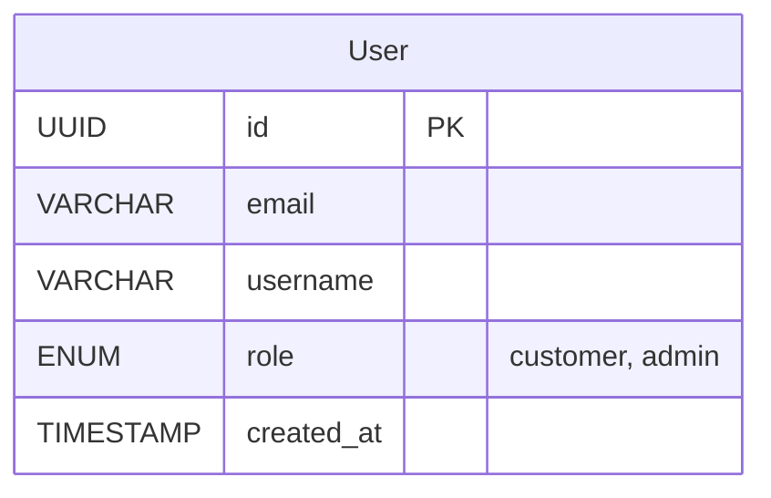

# User API Contract

## Endpoints Overview

| Method | Endpoint             | Description                 |
| ------ | -------------------- | --------------------------- |
| POST   | /users               | Create a new user account   |
| GET    | /users/{id}          | Retrieve user details by ID |
| PATCH  | /users/{id}          | Update user details         |
| DELETE | /users/{id}          | Delete a user account       |
| PATCH  | /users/{id}/password | Update user password        |

## Table



## API Specification

### 1. Create User

**Method**: `POST`  
**Endpoint**: `/users`

#### Request Body:

| Name     | Type   | Description                              |
| -------- | ------ | ---------------------------------------- |
| email    | string | email address (required, must be unique) |
| username | string | username (required)                      |
| password | string | password (required, min 8 characters)    |
| role     | string | role (customer/admin) (required)         |

```json
{
  "email": "john.doe@example.com",
  "username": "john_doe",
  "password": "securePassword123",
  "role": "customer"
}
```

#### Response (Success):

**201 Created**: The user account has been successfully created.

```json
{
  "data": {
    "id": "123e4567-e89b-12d3-a456-426655440000",
    "email": "john.doe@example.com",
    "username": "john_doe",
    "role": "customer"
  }
}
```

#### Response (Error):

**400 Bad Request**: Missing or invalid fields in the request body.

```json
{
  "error": {
    "message": "Invalid request data",
    "details": ["email is required", "password must be at least 8 characters"]
  }
}
```

**409 Conflict**: User with the same email already exists.

```json
{
  "error": {
    "message": "User with this email already exists"
  }
}
```

---

### 2. Get User By Id

**Method**: `GET`  
**Endpoint**: `/users/{id}`

#### Path Parameters:

| Name | Type | Description |
| ---- | ---- | ----------- |
| id   | UUID | User ID     |

#### Response (Success):

**200 OK**: The user account has been successfully retrieved.

```json
{
  "data": {
    "id": "123e4567-e89b-12d3-a456-426655440000",
    "email": "john.doe@example.com",
    "username": "john_doe",
    "role": "customer"
  }
}
```

#### Response (Error):

**404 Not Found**: User not found.

```json
{
  "error": {
    "message": "User not found"
  }
}
```

---

### 3. Update User By Id

**Method**: `PATCH`  
**Endpoint**: `/users/{id}`

#### Path Parameters:

| Name | Type | Description |
| ---- | ---- | ----------- |
| id   | UUID | User ID     |

#### Request Headers:

| Header | Type   | Description                 |
| ------ | ------ | --------------------------- |
| token  | string | JWT token for authorization |

#### Request Body:

| Name     | Type   | Description                      |
| -------- | ------ | -------------------------------- |
| email    | string | email address (must be unique)   |
| username | string | username                         |
| password | string | password (min 8 characters)      |
| role     | string | role (customer/admin) (required) |

```json
{
  "email": "john.doe@example.com",
  "username": "john_doe",
  "password": "securePassword123",
  "role": "customer"
}
```

#### Response (Success):

**200 OK**: The user account has been successfully updated.

```json
{
  "data": {
    "id": "123e4567-e89b-12d3-a456-426655440000",
    "email": "john.doe@example.com",
    "username": "john_doe",
    "role": "customer"
  }
}
```

#### Response (Error):

**400 Bad Request**: Missing or invalid fields in the request body.

```json
{
  "error": {
    "message": "Invalid request data",
    "details": ["email is required", "password must be at least 8 characters"]
  }
}
```

**404 Not Found**: User not found.

```json
{
  "error": {
    "message": "User not found"
  }
}
```

**401 Unauthorized**: User is not authorized to update this user account.

```json
{
  "error": {
    "message": "Unauthorized"
  }
}
```

**403 Forbidden**: User is not authorized to update this user account.

```json
{
  "error": {
    "message": "Forbidden"
  }
}
```

### 4. Delete User By Id

**Method**: `DELETE`
**Endpoint**: `/users/{id}`

#### Path Parameters:

| Name | Type | Description |
| ---- | ---- | ----------- |
| id   | UUID | User ID     |

#### Request Headers:

| Header | Type   | Description                 |
| ------ | ------ | --------------------------- |
| token  | string | JWT token for authorization |

#### Response (Success):

**200 OK**: The user account has been successfully deleted.

```json
{
  "data": {
    "id": "123e4567-e89b-12d3-a456-426655440000",
    "email": "john.doe@example.com",
    "username": "john_doe",
    "role": "customer"
  }
}
```

#### Response (Error):

**404 Not Found**: User not found.

```json
{
  "error": {
    "message": "User not found"
  }
}
```

**401 Unauthorized**: User is not authorized to delete this user account.

```json
{
  "error": {
    "message": "Unauthorized"
  }
}
```

**403 Forbidden**: User is not authorized to delete this user account.

```json
{
  "error": {
    "message": "Forbidden"
  }
}
```

---

### 5. Update User Password By Id

**Method**: `PATCH`
**Endpoint**: `/users/{id}/password`

#### Path Parameters:

| Name | Type | Description |
| ---- | ---- | ----------- |
| id   | UUID | User ID     |

#### Request Headers:

| Header | Type   | Description                 |
| ------ | ------ | --------------------------- |
| token  | string | JWT token for authorization |

#### Request Body:

| Name             | Type   | Description      |
| ---------------- | ------ | ---------------- |
| current_password | string | Current password |
| new_password     | string | New Password     |

```json
{
  "current_password": "currentPassword123",
  "new_password": "newPassword123"
}
```

#### Response (Success):

**200 OK**: The user password has been successfully updated.

```json
{
  "data": {
    "id": "123e4567-e89b-12d3-a456-426655440000",
    "email": "john.doe@example.com",
    "username": "john_doe",
    "role": "customer"
  }
}
```

#### Response (Error):

**400 Bad Request**: Missing or invalid fields in the request body.

```json
{
  "error": {
    "message": "Invalid request data",
    "details": ["current_password and new_password are required", "new_password must be at least 8 characters"]
  }
}
```

**404 Not Found**: User not found.

```json
{
  "error": {
    "message": "User not found"
  }
}
```

**401 Unauthorized**: User is not authorized to update this user's password.

```json
{
  "error": {
    "message": "Unauthorized"
  }
}
``` 

**403 Forbidden**: User is not authorized to update this user's password.

```json
{
  "error": {
    "message": "Forbidden"
  }
}
```